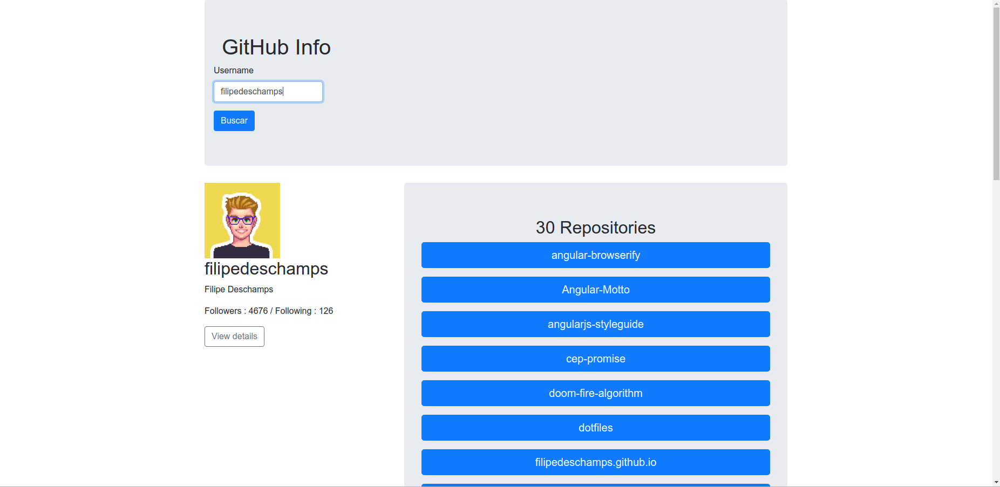

# Get Repositories Info
> This is a sample Project with ReactJS to get Profil and Repositories information from Github





## Description
Project with ReactJS for get a Profil and Repositories from user Github.

The tutorial is on the [jscasts](https://jscasts.teachable.com).
Best of all, it's free.
Thank you @jscasts


## Usage example


[https://carlosziegler.github.io/profil-github-react-bootstrap/](https://carlosziegler.github.io/profil-github-react-bootstrap/)


## Installation


```sh
npm install profil-github-react-bootstrap --save
```

## Frontend building with:

* [React](https://reactjs.org/)


## Repository Clone :
 ```bash
 git clone https://github.com/CarlosZiegler/profil-github-react-bootstrap.git
     
 ```

### Install Dependences Frontend
 ```bash
cd profil-github-react-bootstrap
yarn install
    
 ```
 
#Run  
     
### Running Frondend
 ```bash
 cd profil-github-react-bootstrap
 yarn start
 ```

## Information of Packages:


* [AXIOS](https://www.npmjs.com/package/axios) 
* [REACT](https://www.npmjs.com/package/react)
* [REACT-ROUTER-DOM](https://www.npmjs.com/package/react-router-dom)
* [React-Scripts](https://www.npmjs.com/package/react-scripts)
* [Prop-Types](https://www.npmjs.com/package/prop-types)
* [gh-pages](https://www.npmjs.com/package/gh-pages)
   
   
## Contributing
 Pull requests are welcome. For major changes, please open an issue first to discuss what you would like to change.

## License
[MIT](https://choosealicense.com/licenses/mit/)
